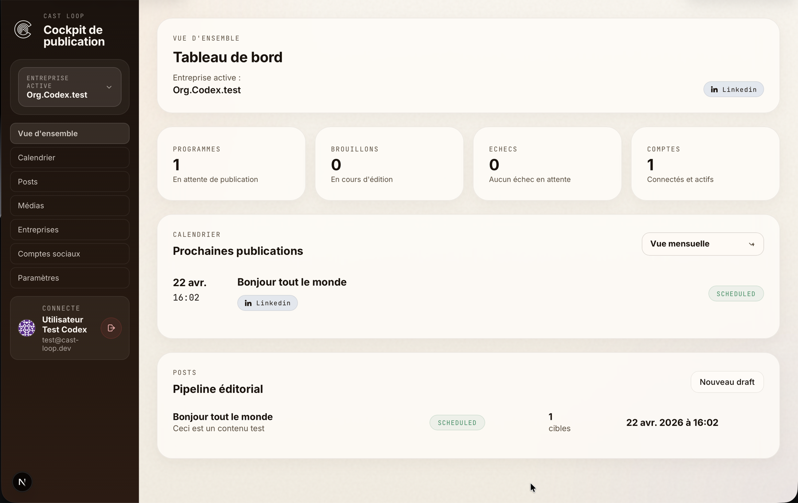

# Cast Loop



Cast Loop est une plateforme SaaS multi-tenant de planification et publication sociale pour agence, opérateur solo ou petite équipe. Le produit permet de connecter plusieurs comptes sociaux, gérer plusieurs entreprises clientes et orchestrer des publications depuis un cockpit unique.

## Vue d'ensemble

Ce dépôt implémente aujourd'hui :

- Connexions sociales : LinkedIn, Facebook, Instagram
- Variants gérés :
  - `linkedin_personal`
  - `linkedin_page`
  - `facebook_page`
  - `instagram_professional`
  - `meta_personal`
- Capacités produit :
  - brouillons
  - calendrier éditorial
  - programmation
  - publication mock ou live
  - historique
  - archivage / restauration
  - rappels Telegram pour les comptes `connect_only`
- Format de contenu v1 : texte + une image

Hors scope actuel :

- analytics
- inbox / commentaires
- workflow d'approbation
- vidéo / carousel
- billing self-serve

## Capture produit

La capture ci-dessus montre le cockpit de publication actuel côté web.

## Stack

- `apps/web` : Next.js 15, App Router, React 19, TypeScript, CSS custom
- `apps/api` : NestJS 10, API REST versionnée sous `/api/v1`
- `packages/shared` : types et contrats partagés buildés vers `dist/`
- `supabase/` : Postgres, Auth, Storage et migrations SQL
- Déploiement cible : web sur Vercel, API Node sur un service séparé

## Architecture

Principes structurants du projet :

- Le frontend ne lit jamais les tables applicatives Supabase directement
- L'authentification passe par Supabase côté web puis validation JWT côté API Nest
- Toute route métier doit être filtrée par organisation et membership
- Le scheduler Nest traite les posts planifiés chaque minute avec verrouillage Postgres
- Les comptes `connect_only` restent visibles mais ne doivent jamais devenir des cibles de publication automatique

Entités métier principales :

- `users`
- `organizations`
- `organization_members`
- `social_accounts`
- `media_assets`
- `posts`
- `post_targets`
- `publish_jobs`
- `audit_logs`

## Mise en route

### 1. Installer les dépendances

```bash
pnpm install
```

### 2. Configurer l'environnement

Le projet utilise un fichier racine `.env`.

```bash
cp .env.example .env
```

Variables importantes :

- Backend :
  - `DATABASE_URL`
  - `SUPABASE_URL`
  - `SUPABASE_SERVICE_ROLE_KEY`
  - `SUPABASE_STORAGE_BUCKET`
  - `TOKEN_ENCRYPTION_KEY`
  - `APP_WEB_URL`
  - `SOCIAL_PUBLISH_MODE`
- Frontend :
  - `NEXT_PUBLIC_API_URL`
  - `NEXT_PUBLIC_SUPABASE_URL`
  - `NEXT_PUBLIC_SUPABASE_ANON_KEY`

Générer `TOKEN_ENCRYPTION_KEY` avec :

```bash
node -e "console.log(require('crypto').randomBytes(32).toString('base64'))"
```

Important :

- Pour `DATABASE_URL`, utiliser la chaîne Session pooler Supabase en IPv4
- La connexion directe `db.<ref>.supabase.co:5432` est IPv6-only et peut casser avec `EHOSTUNREACH`
- `SOCIAL_PUBLISH_MODE=mock` est le mode recommandé par défaut en local

### 3. Appliquer les migrations

Toute évolution de schéma passe par un nouveau fichier SQL dans `supabase/migrations/`.

Migrations présentes :

- `0001_init.sql`
- `20260417100000_add_posts_archived_at.sql`
- `20260417123000_add_social_accounts_provider_external_unique.sql`
- `20260419153458_add_social_account_capabilities_and_telegram_reminders.sql`

Configurer aussi le bucket Storage défini dans `SUPABASE_STORAGE_BUCKET`.

### 4. Lancer le projet en local

```bash
pnpm dev:api
pnpm dev:web
```

URLs locales par défaut :

- Web : `http://localhost:3000`
- API : `http://localhost:4000/api/v1`

Si vous modifiez `packages/shared`, rebuild avant de relancer l'API ou le build complet :

```bash
npm run build --workspace @cast-loop/shared
```

## Scripts utiles

| Commande | Description |
|---|---|
| `pnpm install` | Installe toutes les dépendances du monorepo |
| `pnpm dev:web` | Lance le frontend Next.js |
| `pnpm dev:api` | Lance l'API NestJS en watch |
| `pnpm build` | Build `shared`, puis `api`, puis `web` |
| `pnpm typecheck` | Lance `tsc --noEmit` sur `api` et `web` via les scripts workspace |
| `pnpm lint` | Lance ESLint sur le code source |
| `pnpm test` | Exécute les tests Jest de l'API |
| `npm run test --workspace @cast-loop/api -- path/to/file.spec.ts` | Exécute un test API ciblé |
| `npm run start --workspace @cast-loop/api` | Lance l'API compilée |

## Pipeline de publication

États de post :

- `draft`
- `scheduled`
- `publishing`
- `published`
- `failed`
- `cancelled`

Statuts de cible :

- `pending`
- `published`
- `notified`
- `failed`
- `cancelled`

Le scheduler :

- sélectionne les posts `scheduled` dus
- verrouille les lignes en base
- publie les cibles `publishable`
- envoie un rappel Telegram pour les cibles `connect_only` si demandé
- journalise les traitements dans `publish_jobs` et `audit_logs`

## Interfaces publiques actuelles

```text
POST   /auth/session/validate

GET    /organizations
POST   /organizations

GET    /organizations/:id/social-accounts
POST   /organizations/:id/social-accounts
GET    /organizations/:id/social-accounts/providers
POST   /organizations/:id/social-accounts/:provider/start
GET    /organizations/:id/social-accounts/pending-selection
POST   /organizations/:id/social-accounts/pending-selection/complete
DELETE /organizations/:id/social-accounts/:accountId

GET    /social-auth/linkedin/callback
GET    /social-auth/meta/callback

GET    /media
GET    /media/:id/view-url
POST   /media/upload-url

GET    /posts
POST   /posts
PATCH  /posts/:id
POST   /posts/:id/schedule
POST   /posts/:id/publish-now
POST   /posts/:id/cancel
POST   /posts/:id/archive
POST   /posts/:id/restore
DELETE /posts/:id

GET    /calendar?organizationId=...&from=...&to=...
```

## Références

- Cadrage initial : [`docs/PLAN.md`](docs/PLAN.md)
- Consignes agents : [`AGENTS.md`](AGENTS.md)
